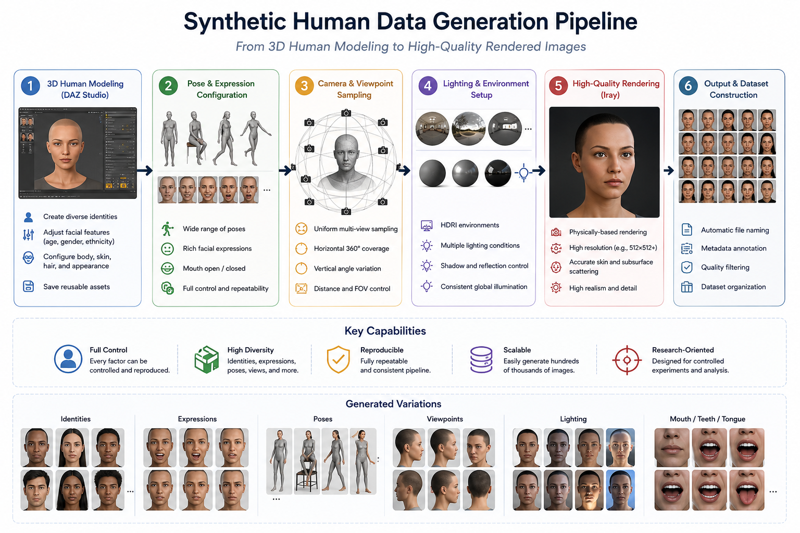
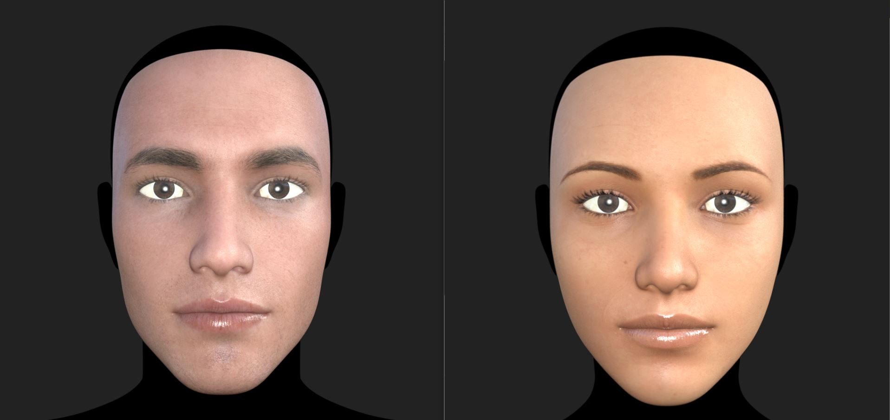
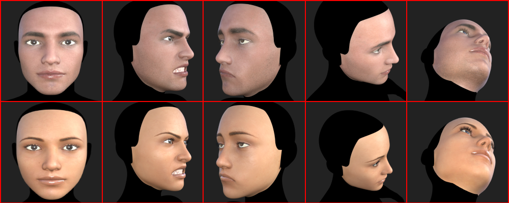
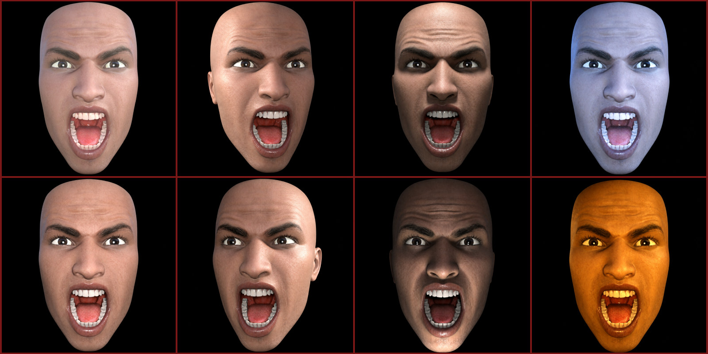
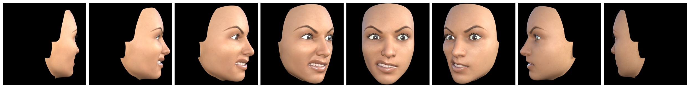

# Figures

This directory contains the primary figures used throughout the documentation to illustrate the synthetic dataset generation pipeline, rendering configuration, and acquisition strategy.

---

## Pipeline Overview

  

Illustrates the complete synthetic dataset generation workflow, including character preparation, expression application, camera sampling, lighting variation, rendering, metadata generation, and final dataset organization.

---

## Base Characters

  

Base Genesis 8 Male and Genesis 8 Female characters used throughout the dataset generation process. A single identity was maintained for each gender to isolate pose, expression, and illumination variations.

---

## Camera Sampling Strategy

  

Visualization of the predefined camera viewpoints used during rendering. Each expression preset was rendered from 215 fixed viewpoints, providing dense coverage across yaw, pitch, and perspective changes.

---

## Lighting Configuration

  

Representative lighting configurations used to increase illumination diversity, including frontal, directional, warm, cool, and colored lighting conditions.

---

## Preset Progression

  

Example sequence showing multiple rendered viewpoints generated from a single facial-expression preset.

---

All figures are provided solely for documentation purposes and summarize the rendering methodology adopted in this project.
