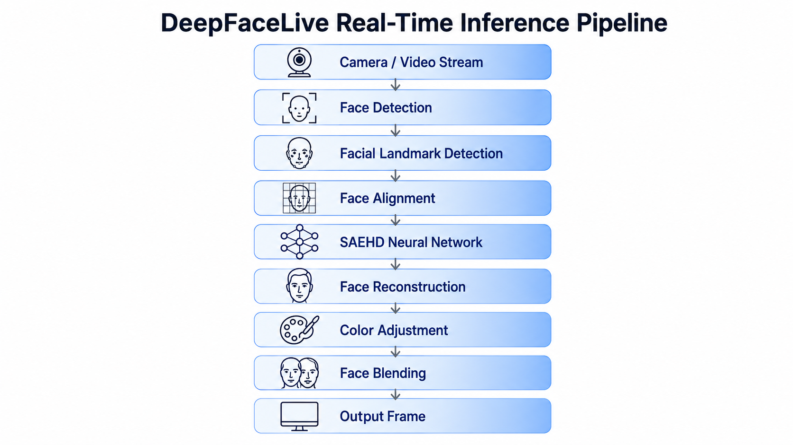
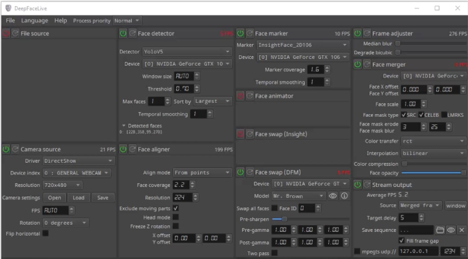
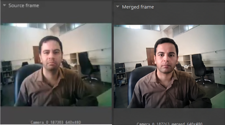
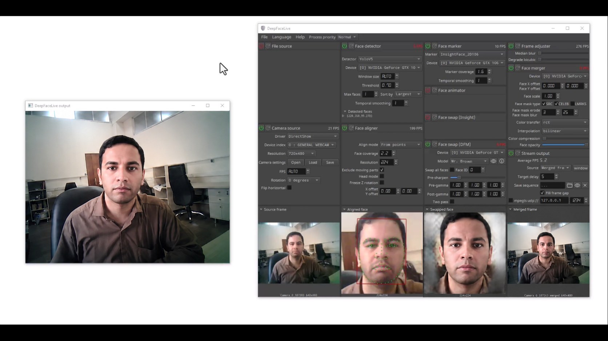
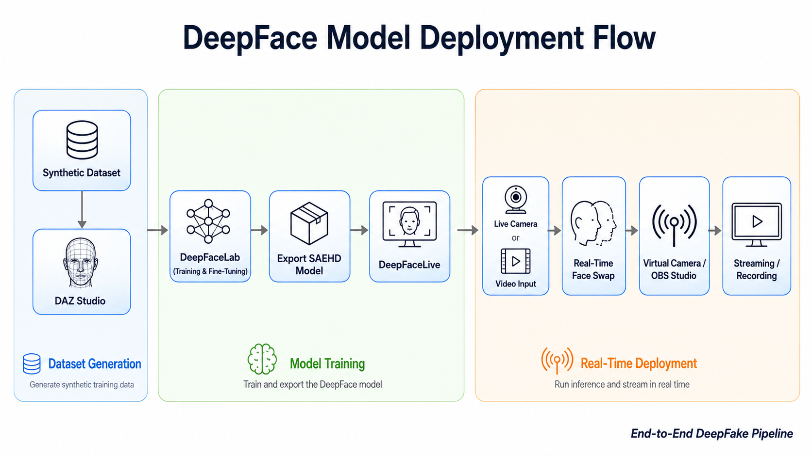

# Figures

This directory contains the figures used throughout the project documentation. These illustrations summarize the complete workflow, training pipeline, deployment process, and representative outputs of the synthetic human dataset generation framework.

---

## Figure Overview

| Figure | Description |
|--------|-------------|
| **deepfacelive_pipeline.png** | Processing pipeline of DeepFaceLive, illustrating the sequence of face detection, landmark estimation, alignment, neural inference, face reconstruction, blending, and real-time rendering. |
| **interface_overview.png** | Overview of the DeepFaceLive user interface highlighting the major processing modules and runtime controls. |
| **input_output_example.png** | Example showing an original input frame and the corresponding face-swapped output produced by the trained model. |
| **realtime_demo.png** | Demonstration of real-time inference using DeepFaceLive during live webcam processing. |
| **deployment_flow.png** | End-to-end deployment workflow from synthetic dataset generation and DeepFaceLab training to real-time inference in DeepFaceLive using a virtual camera and OBS Studio. |

---

## Figure Gallery

### DeepFaceLive Processing Pipeline

---

### DeepFaceLive Interface

---

### Input vs Output

---

### Real-Time Demonstration

---

### Deployment Workflow

---

## Notes

- All figures were produced as part of this project.
- The diagrams are intended to document the complete synthetic data generation, model training, and real-time deployment workflow.
- Screenshots were captured during actual experiments using DeepFaceLab and DeepFaceLive.
- Images are referenced throughout the project documentation to improve reproducibility and understanding of the proposed pipeline.
