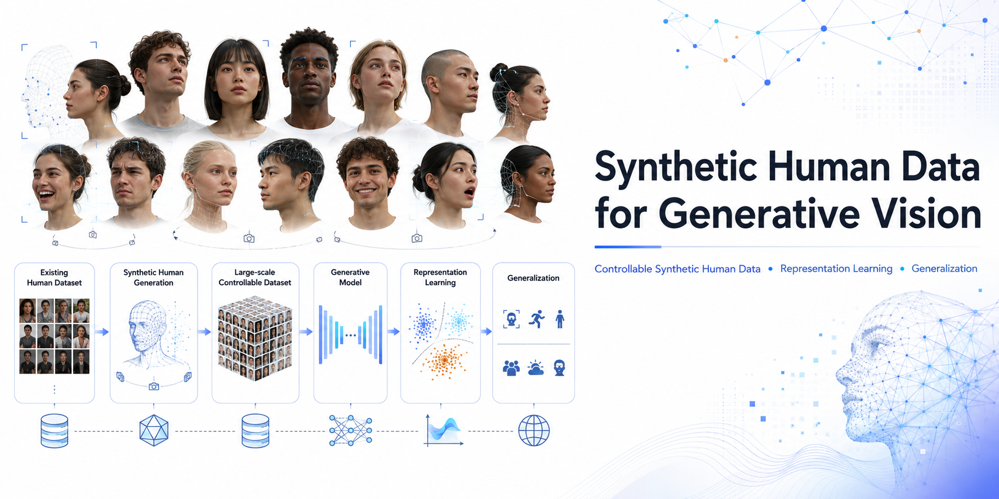
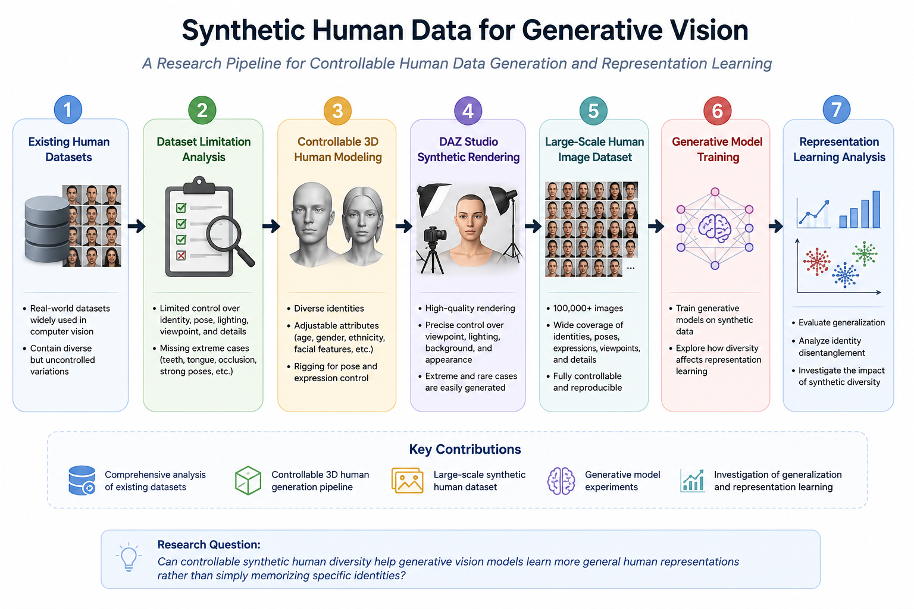
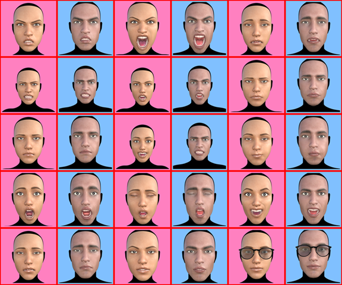
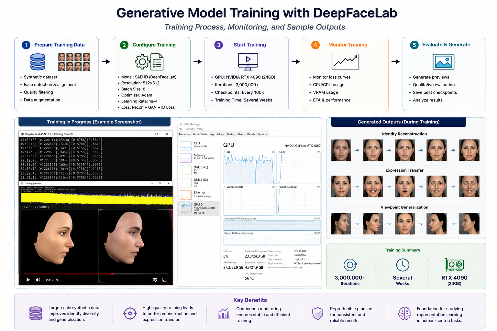
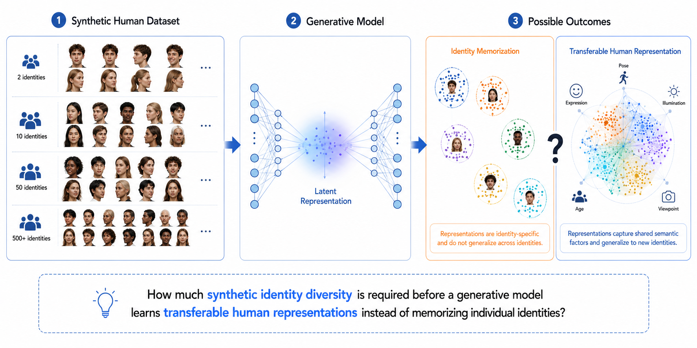

<p align="center">

# Synthetic Human Data for Generative Vision

### A Research Project on Controllable Synthetic Human Data Generation, Representation Learning, and Generalization

</p>

---

<p align="center">



</p>

---

## Overview

Synthetic human data has become increasingly important for training modern computer vision and generative AI systems. Despite the availability of large public datasets, many existing datasets provide limited control over identity, facial attributes, viewpoints, expressions, illumination, and detailed anatomical structures.

This project investigates whether **large-scale controllable synthetic human data** can facilitate more systematic studies of representation learning and model generalization.

Rather than introducing a new generative model, this repository focuses on building a reproducible synthetic data generation pipeline and using it as a research platform for studying how synthetic diversity influences visual learning.

---

# Motivation

The project began with an extensive analysis of publicly available human datasets.

During this review, several practical limitations repeatedly appeared:

- Limited identity diversity
- Insufficient extreme viewpoints
- Limited facial expression coverage
- Missing tongue and oral cavity variations
- Limited teeth visibility
- Inconsistent lighting conditions
- Limited control over rendering parameters
- Difficult reproducibility

These observations motivated the construction of a fully controllable synthetic human dataset.

---

# Research Goal

The long-term objective of this research is to better understand how synthetic human data influences visual representation learning.

More specifically, this project investigates:

- controllable human identity generation
- synthetic data diversity
- identity transformation
- representation learning
- generalization
- future human foundation models

---

# Project Pipeline

<p align="center">



</p>

The project follows a seven-stage research pipeline:

1. Dataset Analysis
2. Synthetic Dataset Generation
3. Model Training
4. Experimental Results
5. Open Research Question
6. Representation Analysis
7. Generalization

Each stage is documented independently inside this repository.

---

# Repository Structure

```text
01_dataset_analysis/
        Analysis of existing public datasets.

02_synthetic_dataset_generation/
        Synthetic human generation pipeline.

03_model_training/
        Model training and implementation.

04_results/
        Experimental observations and results.

05_open_research_question/
        Central scientific question emerging from this project.

06_representation_analysis/
        Future representation learning analysis.

07_generalization/
        Planned generalization experiments.
```

---

# Dataset Preview

<p align="center">



</p>

The synthetic dataset contains controllable variations across multiple visual factors, including:

- Identity
- Pose
- Viewpoint
- Expression
- Lighting
- Mouth
- Teeth
- Tongue

allowing reproducible experiments that are difficult to perform using unconstrained real-world datasets.

---

# Training Pipeline

<p align="center">



</p>

To validate the generated synthetic dataset, initial experiments were conducted using an autoencoder-based face generation framework.

The objective of these experiments is not merely identity transformation, but to investigate what information is actually learned by the latent representation under controlled synthetic supervision.

---

# Experimental Observations

The preliminary experiments produced realistic identity-specific results under controlled conditions.

However, they also raised a more fundamental scientific question.

The visual quality of the generated faces alone does not reveal whether the learned latent space captures

- transferable human concepts

or simply

- identity-specific mappings.

This observation motivates the next stage of this research.

---

# Central Research Question

<p align="center">



</p>

The central question of this project is:

> **How can we determine whether increasing synthetic identity diversity enables a generative model to learn transferable human representations rather than merely memorizing identity-specific visual patterns?**

This question connects synthetic data generation, representation learning, and generalization.

---

# Current Status

✅ Public dataset analysis completed

✅ Synthetic human generation pipeline completed

✅ Large-scale synthetic dataset generated

✅ Initial model training completed

✅ Initial qualitative evaluation completed

🟡 Representation analysis planned

🟡 Generalization experiments in progress

---

# Repository Roadmap

```
Dataset Analysis
        ↓
Synthetic Dataset Generation
        ↓
Model Training
        ↓
Experimental Results
        ↓
Open Research Question
        ↓
Representation Learning
        ↓
Generalization
```

---

# Future Directions

Future work will investigate:

- scalable synthetic identity generation
- synthetic-to-real transfer
- latent representation analysis
- identity diversity scaling
- compositional human representations
- human foundation models

---

# Project Demo

A demonstration video illustrating the data generation and training process is available in:

```
videos/
```

Additional figures, animations, and qualitative results are provided throughout the repository.

---

# Citation

This repository documents an ongoing independent research project.

If this work contributes to your research, please consider citing the repository once an official technical report or publication becomes available.

---

# Acknowledgements

This project was developed as an independent research effort exploring controllable synthetic human data generation, representation learning, and generalization in computer vision.

The repository is intended to serve as an open research platform for future collaboration and scientific discussion.
